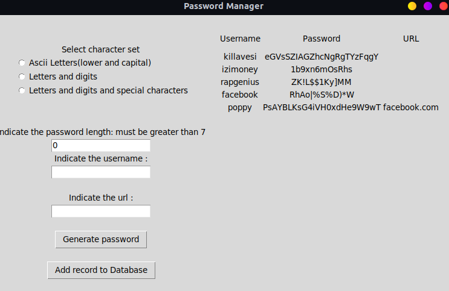

# Goal of this program

I made this program to learn a little bit of Python: basic data types(string, integer,...), control structures(if, for), loops, input/output, packaging and imports,...

I used the default GUI framework for Python: Tkinter for the interactive part.

For the database I started with SQLite which is shipped with Python 3 then migrated to PostgreSQL as it offers more security features.



# What is it?

It's a software that generates a random string of characters that serves as a strong password.

It also stores them.

# Features

- Generate password using 3 characters sets: ASCII letters, ASCII Letters and digits, ASCII Letters and digits and special characters
- Generate a password of arbitrary length, must be > 7
- Save a url associated with the username/password pair
- Protect the application with a master password

## A strong password

The most common passwords (basic alphanumeric) can be guessed in a matter of seconds. The solidity and resilience of a password is measured by the time an attacker could take to break it. The solidity of the password is proportionnal to the time it would take the attacker to guess it.

- Length: A good password is at least 8 characters long.  A 7 characters long password that consists of alphanumeric characters takes 3 hours to guess. A 8 characters long password takes 10 days.
- Diversity: Mix the characters, use lower alphabet letters, capital letters, numbers, special characters,...
- Accessibility: Make your passwords secret and never let anyone have access to them.

You can check if your password is strong enough on this [website](https://howsecureismypassword.net/).

# Dependencies

You must have [Psycopg](https://www.psycopg.org/docs/index.html) installed.
Everything else are native Python libraries.

# How to use it

```bash
git clone https://github.com/zakaria-me/password-generator password-generator/
python3 main.py
```

Then follow the instructions prompted on your screen.
